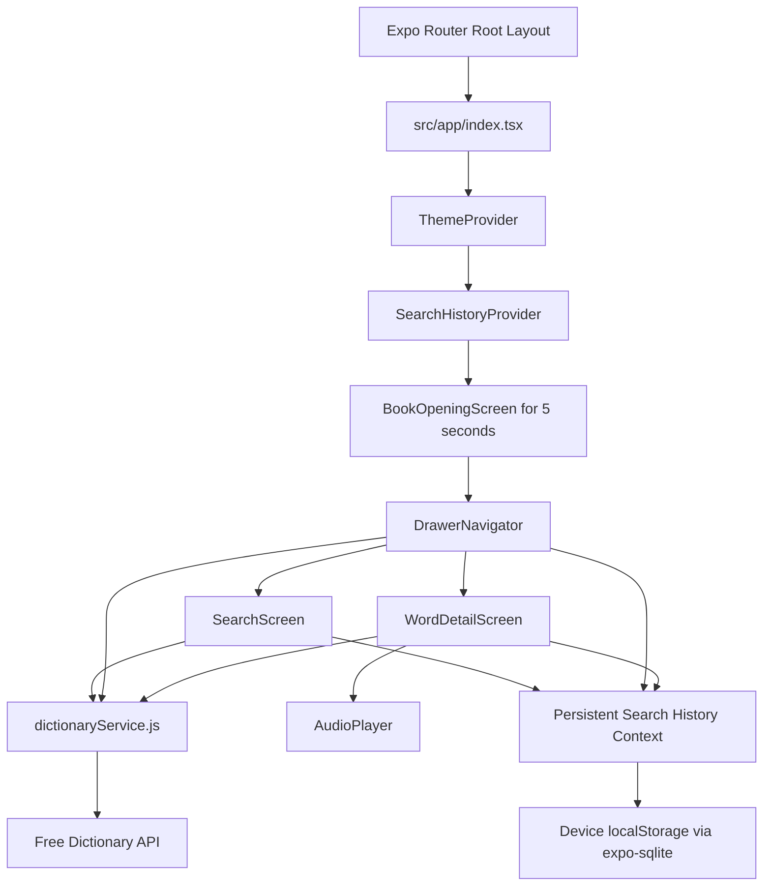
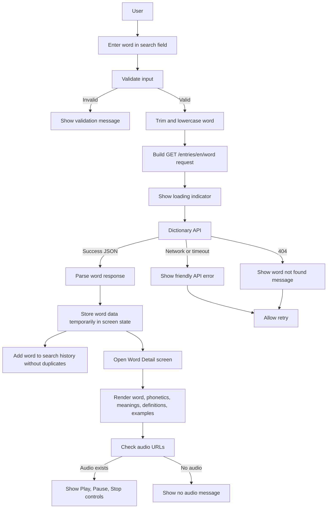

# LexiTech Dictionary App Design

This document records the required planning work for the Dictionary Mobile Application: data flow, architecture, API endpoint, pages, validation, and activity coverage.

## Problem Summary

LexiTech Solutions Ltd needs a cross-platform React Native mobile application that helps users search English words, read definitions, view parts of speech and examples, listen to pronunciations where available, and recover gracefully from invalid input or API failures.

## API Endpoint

Base endpoint:

```text
https://api.dictionaryapi.dev/api/v2/entries/en/
```

Dynamic word lookup:

```text
GET https://api.dictionaryapi.dev/api/v2/entries/en/{word}
```

Example:

```text
GET https://api.dictionaryapi.dev/api/v2/entries/en/innovation
```

The endpoint is implemented in `src/services/dictionaryService.js` using the `axios` library.

## Pages And Screens

- `BookOpeningScreen`: shows the five-second book-opening loading experience before the app enters the dictionary.
- `SearchScreen`: accepts a word, validates input, shows autocomplete from history, requests the API, and navigates to details.
- `WordDetailScreen`: displays the word, phonetic text, audio pronunciations, parts of speech, definitions, and examples.
- `DrawerNavigator`: provides drawer navigation, theme switching, persistent search history, history replay, and clear history.

## Application Architecture



## Data Flow Diagram



## Validation Rules

Search input is validated in both `SearchScreen.js` and `dictionaryService.js`.

- Empty input shows: `Please enter a word to search.`
- Multiple words or sentences show: `Please search for one word, not a sentence.`
- Numbers show: `Please search for a word instead of numbers.`
- Symbols show: `Please search for a word instead of numbers.`
- Words shorter than 2 characters are rejected.
- Words longer than 50 characters are rejected.
- API requests are only made after validation passes.

There are no date or time input fields in this app. If date or time fields are added later, they must be validated before use in the same service-driven pattern.

## Error Handling

The app handles:

- `404` word not found responses.
- Network failures.
- Request timeouts.
- Empty or malformed API responses.
- Missing audio URLs.
- Audio playback failures.
- Empty search history.
- Empty word detail data.

User-facing error UI is rendered through `ErrorMessage.js`, and retry actions are provided where a failed request can be repeated.

## Activity Coverage

### Activity 1: Word Search And API Integration

Implemented in `SearchScreen.js` and `dictionaryService.js`.

- Search input and button are present.
- Input is validated before API calls.
- Submitted word is captured and normalized.
- Dynamic URL is built using the entered word.
- `axios` sends the HTTP GET request.
- Loading indicator appears while the request is running.
- JSON response is parsed and checked.
- Fetched data is stored temporarily and passed to the detail screen.

### Activity 2: Display Word Details

Implemented in `WordDetailScreen.js` and `DefinitionCard.js`.

- Main word is shown prominently.
- Phonetic spelling is displayed when available.
- Parts of speech are shown for each meaning.
- Definitions are listed under each meaning.
- Example sentences are displayed when provided.
- Multiple meanings and long definitions are supported through scrollable cards.
- Consistent spacing, typography, and themed styling are applied.

### Activity 3: Audio Pronunciation Feature

Implemented in `WordDetailScreen.js` and `AudioPlayer.js`.

- Audio URLs are detected from API phonetics.
- Invalid or missing audio URLs are skipped.
- Multiple pronunciations are supported and labeled by region when possible.
- Play, Pause, and Stop controls manage audio state.
- Only one pronunciation plays at a time.
- Audio can be replayed multiple times.
- Playback errors are caught and shown to the user.
- A no-audio message appears when no pronunciation file is available.

### Activity 4: Drawer Navigation And Search History

Implemented in `DrawerNavigator.js` and `SearchHistoryContext.js`.

- Drawer navigation wraps the app.
- Search history stores successful searched words and reloads them from device storage after app reloads.
- Duplicate words are prevented by removing existing matches before adding the latest search.
- History items appear in the drawer.
- Tapping a history word triggers a fresh API request.
- The word detail screen refreshes with the selected word data.
- Clear History is available in the drawer.

### Activity 5: Error Handling And User Feedback

Implemented in `dictionaryService.js`, `SearchScreen.js`, `WordDetailScreen.js`, `DrawerNavigator.js`, and `ErrorMessage.js`.

- Word-not-found responses show a friendly message.
- Network and timeout errors show readable messages.
- Loading states hide when errors occur.
- Malformed or empty responses are prevented from crashing the app.
- Retry is available after failed searches.
- Empty states are shown before searching and when history is empty.

## Testing With Expo CLI

Start the app with:

```bash
npx expo start
```

Recommended manual test cases:

- Empty search.
- Multiple words, such as `good morning`.
- Numbers, such as `word123`.
- Symbols, such as `hello!`.
- Valid word with audio, such as `hello`.
- Valid word with multiple meanings, such as `run`.
- Word not found, such as `zzzznotaword`.
- Search from drawer history.
- Clear search history.
- Toggle light and dark mode.
